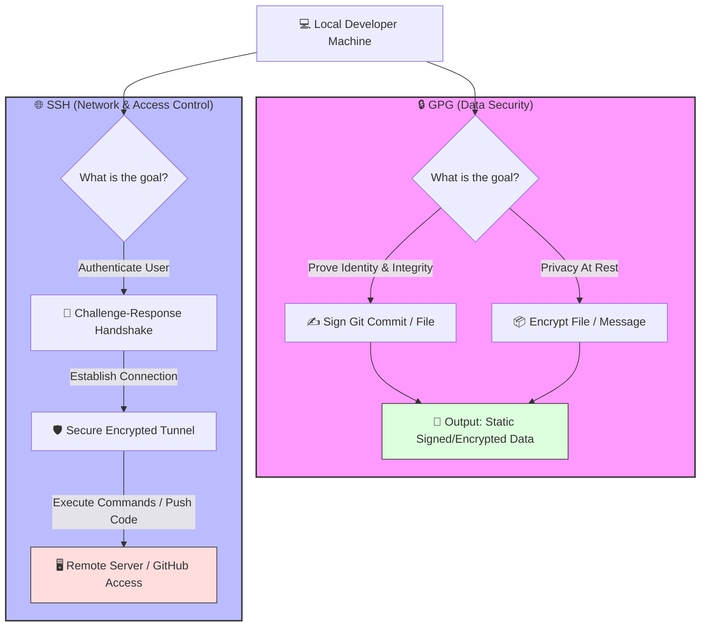

```mermaid
graph TD
    %% Core Nodes
    User[💻 Local Developer Machine]
    
    subgraph GPG ["🔒 GPG (Data Security)"]
        GPG_Action{What is the goal?}
        GPG_Sign[✍️ Sign Git Commit / File]
        GPG_Encrypt[📦 Encrypt File / Message]
        GPG_Output[💾 Output: Static Signed/Encrypted Data]
        
        GPG_Action -->|Prove Identity & Integrity| GPG_Sign
        GPG_Action -->|Privacy At Rest| GPG_Encrypt
        GPG_Sign --> GPG_Output
        GPG_Encrypt --> GPG_Output
    end

    subgraph SSH ["🌐 SSH (Network & Access Control)"]
        SSH_Action{What is the goal?}
        SSH_Auth[🔑 Challenge-Response Handshake]
        SSH_Tunnel[🛡️ Secure Encrypted Tunnel]
        SSH_Remote[🖥️ Remote Server / GitHub Access]
        
        SSH_Action -->|Authenticate User| SSH_Auth
        SSH_Auth -->|Establish Connection| SSH_Tunnel
        SSH_Tunnel -->|Execute Commands / Push Code| SSH_Remote
    end

    %% Connections from User
    User --> GPG_Action
    User --> SSH_Action

    %% Styling
    style GPG fill:#f9f,stroke:#333,stroke-width:2px
    style SSH fill:#bbf,stroke:#333,stroke-width:2px
    style GPG_Output fill:#dfd,stroke:#333,stroke-width:1px
    style SSH_Remote fill:#fdd,stroke:#333,stroke-width:1px
```
